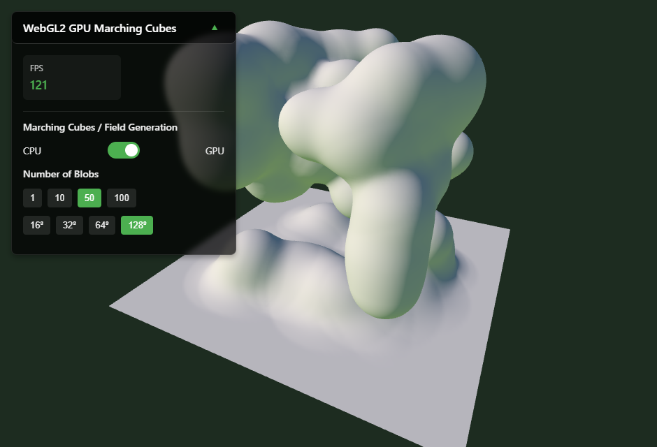

# WebGL2 GPU Marching Cubes

A performant, interactive marching cubes demo in WebGL2, featuring a modern, fully GPU-accelerated marching cubes pipeline. Switch between a classic CPU implementation (inspired by Greggman's "immediate sim" approach) and a cutting-edge GPU version that generates both the field and the mesh entirely on the GPU—no mesh upload, no CPU bottlenecks.

## Demo

> Live demo: [https://cybercyril.com/3mc/]

---

## Features

- **GPU Marching Cubes (Primary)**: Entire isosurface extraction and rendering performed on the GPU, with zero mesh upload and a single draw call per frame.
- **CPU Immediate Sim (Legacy/Reference)**: Classic "immediate mode" CPU marching cubes, inspired by [Greggman's metaballs demo](https://webglsamples.org/blob/blob.html).
- **Interactive Controls**: Adjust number of blobs and grid resolution; real-time camera movement and settings panel.
- **Performance Dashboard**: Live FPS counter and settings.
- **Production Ready**: Modern TypeScript, Vite, and WebGL2; easy to deploy and extend.

---

## Table of Contents

- [GPU Marching Cubes](#gpu-marching-cubes-your-implementation)
- [CPU Immediate Sim](#cpu-immediate-sim-legacyreference)
- [Optimizations](#optimizations)
- [How to Run](#how-to-run)
- [Controls](#controls)
- [References](#references)
- [Credits](#credits)
- [License](#license)

---

## GPU Marching Cubes

The GPU mode is the centerpiece of this project, demonstrating a fully parallel, real-time marching cubes pipeline:

- **Field Generation**: A fragment shader computes the 3D scalar field (metaballs + floor) in a single pass, packing the 3D grid into a 2D tiled texture.
- **Isosurface Extraction**: A custom vertex shader reconstructs the marching cubes mesh on-the-fly, using lookup tables (edge/triangle) encoded as textures.
- **Single Draw Call**: The entire surface is rendered in a single draw call, with no geometry uploaded from the CPU.
- **No CPU Bottleneck**: All heavy computation (field, geometry, normals) is performed on the GPU, enabling high resolutions and blob counts at interactive framerates.
- **Accurate Matching**: The GPU algorithm is mathematically aligned with the CPU version, so switching modes produces identical results.

**Optimizations:**
- **Tiled 2D Field Texture**: Efficiently packs the 3D field for fast shader access.
- **Table Textures**: Edge and triangle tables are stored as RGBA 2D textures for rapid lookup.
- **Parallel Geometry**: Vertex shader computes triangle positions and normals per-cube, per-triangle, on the fly.
- **Minimal CPU-GPU Transfer**: Only small uniform and texture updates per frame.

---

## CPU Immediate Sim

The CPU mode implements the classic "immediate mode" marching cubes algorithm, inspired by Greggman's metaballs demo
- **Field Generation**: Each voxel in the 3D grid accumulates contributions from all blobs and a floor term.
- **Marching Cubes**: For each cube, the algorithm uses precomputed tables to determine which edges are intersected and where to interpolate vertices.
- **Immediate Rendering**: Mesh vertices/normals are generated and rendered each frame, with batching for performance.

This mode is valuable as a reference and for comparison, but is limited in performance at high resolutions or blob counts due to CPU bottlenecks.

---

## Optimizations

### GPU
- All field and geometry calculations on GPU
- Tiled 2D textures for 3D data
- Edge/triangle tables as textures

### CPU
- Blob influence culling (limits updates to affected voxels)
- Typed arrays for fast field/normal storage
- Batching of geometry for fewer draw calls

---

## How to Run

git clone https://github.com/3merillon/WebGL2-GPU-Marching-Cubes.git
cd WebGL2-GPU-Marching-Cubes
npm install
npm run dev

Open [http://localhost:5173](http://localhost:5173) in your browser.

**Requirements:**
- Modern browser with WebGL2 and `EXT_color_buffer_float` (Chrome, Firefox, Edge, Safari 16+).
- Node.js (for development).

---

## Controls

- **Camera**: Drag with mouse or touch to look. WASD to move. Pinch to zoom.
- **CPU/GPU Toggle**: Switch between CPU and GPU marching cubes in the dashboard.
- **Number of Blobs**: Choose 1, 10, 50, or 100 blobs.
- **Resolution**: Choose grid size (16³, 32³, 64³, 128³).

---

## References

- **Marching Cubes Algorithm & Marching Cubes Tables**: [Paul Bourke's tables](http://paulbourke.net/geometry/polygonise/)
- **Metaballs in JavaScript (Greggman's Demo)**:  
  [https://webglsamples.org/blob/blob.html](https://webglsamples.org/blob/blob.html)
- **Tiled 3D Textures in WebGL**:  
  [https://webgl2fundamentals.org/webgl/lessons/webgl-data-textures.html](https://webgl2fundamentals.org/webgl/lessons/webgl-data-textures.html)

---

## Credits

- **GPU Marching Cubes Implementation**: [@3merillon](https://cybercyril.com/3mc/)
- **CPU Immediate Sim Inspiration**: [Gregg Tavares (Greggman) : Metaballs in JavaScript Demo](https://webglsamples.org/blob/blob.html)
- **Marching Cubes Tables**: Paul Bourke

---

## License

This project is licensed under the MIT License. See [LICENSE](LICENSE) for details.